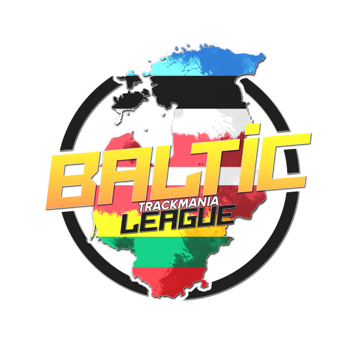

	<nav class="btl-sidebar" aria-label="Main navigation">
		<h2>Baltic Trackmania</h2>
		<a class="active" href="./index.html">Rulebook</a>
		<a href="./standings.html">Standings Sheet</a>
	</nav>

	<main class="btl-main">

# Baltic Trackmania League

Rulebook Version: 23022026.1

## Table of Contents

1. [Event Overview](#1-event-overview)
2. [Participation](#2-participation)
3. [Registration](#3-registration)
4. [Rewards](#4-rewards)
5. [Event Structure](#5-event-structure)
6. [Event Schedule and Location](#6-event-schedule-and-location)
7. [Streaming](#7-streaming)
8. [Appendix 1 - Game Settings](#8-appendix-1---game-settings)

## 1. Event Overview

The Baltic Trackmania League is a series of Trackmania tournaments in the Baltic region (Latvia, Lithuania, Estonia).

The Winter 2026 edition takes place in Trackmania (2020) and consists of:
- Division League Stages
- Last Chance Qualifier
- Final Event

Organizers reserve the right to adjust rules during the competition when needed.

## 2. Participation

To participate in the League, a player must be from one of the Baltic States (Latvia, Lithuania, Estonia) and have Trackmania (2020) Club Access on PC, console, or cloud.

### 2.1 Eligibility

Players may be asked to provide documents that verify residency or nationality.

A participant is eligible if at least one of the following is true:
- The player has a passport from Latvia, Lithuania, or Estonia.
- The player has legal residency in Latvia, Lithuania, or Estonia.

### 2.2 Flag Requirement

Players must use the country flag of the nation they represent. Failure to do so may result in disqualification.

### 2.3 Staff and Mappers

Staff members and mappers are allowed to participate.

### 2.4 Disciplinary Actions

- Suspicious registration from unrelated regions may result in a 3-year ban.
- Flag misuse may result in a 6-month ban.
- Use of third-party software that alters game physics results in a permanent ban from Baltic events.
- Playing under another player's profile results in a permanent ban from future Baltic events.

### 2.5 Code of Conduct

- Participants must uphold fair competition and play to the best of their ability.
- Intentional trolling or unnecessary DNFs are not tolerated and may lead to a one-season suspension.
- Once a player confirms participation after qualifying, they are expected to play all scheduled matches until elimination.
- Missing matches without timely communication may result in a one-season suspension.
- Emergencies can be considered if communicated to admins in time.
- Rude behavior toward staff or participants may result in a one-season suspension, including other Baltic Trackmania-related events.

## 3. Registration

Registration is handled in-game through the Events tab or the Baltic Trackmania club.

### 3.1 Requirements

To register, players must:
- Have Club Access
- Meet all participation criteria
- Be present in the Baltic Trackmania Discord, where official communication is handled

Discord: https://discord.gg/G9nr3Pa

### 3.2 Registration Window

- Registration opens 3 days before each stage.
- Registration for each stage remains open until 20:59 EET on event day.

### 3.3 Registration Location

Play -> Live -> Events -> BTL <Stage X>

With registration, participants agree to this rulebook and the Ubisoft Code of Conduct for the entire competition.

## 4. Rewards

The prize pool is announced through official communication channels and may be updated here.

### 4.1 Historical Prize Pool Notes

- Spring 2023: 340 EUR
- Summer 2023: 340 EUR, CCB qualification
- Spring 2024: CCB qualification
- Summer 2024: 500 EUR
- Winter 2025: 400 EUR, CCB qualification
- Fall 2025: 400 EUR
- Winter 2026: 400 EUR (to be concluded)

### 4.2 Winter 2026 Base Prize Pool

Base prize pool: 400 EUR

Final Event play-off rewards:
1. 200 EUR
2. 125 EUR
3. 50 EUR
4. 25 EUR

Additional rewards:
- Custom champion car skin by mars_dzn
- Secret Prize 2

The prize pool may increase during the competition through community contributions.

Base prize money is paid by Marchielli via direct bank transfer only.
Provider contact: Discord user marchielli

The Winter 2026 prize pool is provided by Marchielli.
Additional expenses are covered by Matty from GOTA: https://www.mbgota.com/

## 5. Event Structure

Baltic Trackmania League Winter 2026 consists of:
- League Division Stages
- Last Chance Qualifier
- Final Event

### 5.1 Division Stages

The League has 6 stages, played on Wednesdays and Saturdays at 21:00 EET (after COTD).

Each stage has:
- Time Attack Qualification and Seeding (15 minutes)
- Division Play

#### 5.1.1 Divisions

Players are split into divisions by qualification result:
- Division 1: 8 players
- Division 2: 8 players
- Division 3: up to 24 players

If a division has fewer than 4 players, those players move into the upper division, and points are repartitioned jointly.

#### 5.1.2 Division Match Format

- Mode: Cup Classic
- Bracket: Double Elimination
- Map: the stage map from qualification

Points are awarded by tier:
- Gold Points
- Silver Points
- Bronze Points

Official standings prioritize points in this order:
1. Gold
2. Silver
3. Bronze

Official standings use each player's 3 best stage performances.

| Placement | Division 1 | Division 2 | Division 3 |
| :-- | :-- | :-- | :-- |
| 1st | 10 Gold | 1 Gold | 2 Silver |
| 2nd | 6 Gold | 10 Silver | 1 Silver |
| 3rd | 4 Gold | 6 Silver | 10 Bronze |
| 4th | 3 Gold | 4 Silver | 6 Bronze |
| 5th-6th | 2 Gold | 3 Silver | 4 Bronze |
| 7th-8th | 1 Gold | 2 Silver | 2 Bronze |
| Participation | - | - | 1 Bronze |

Stage results contribute toward qualification for the Final Event.

Tie-breakers for stage standings:
1. Gold Points
2. Silver Points
3. Bronze Points
4. Total Gold Points
5. Total Silver Points
6. Total Bronze Points
7. Last Event Placement
8. Last Event Qualification Score Placement

### 5.2 Finals Event

The Finals Event has 16 players:
- Winners of qualifier stages receive direct invites to play-offs.
- Stage winners are guaranteed Seed 6 or above.
- Remaining play-off slots are filled by Official Points standings to complete 14 players.
- Last Chance Qualifier winner and runner-up complete the final 16.

Stage-winner seeding tie-breakers:
1. Number of stages won
2. Official points standings
3. Total points standings
4. Earlier stage win priority (Stage 1 > Stage 2 > ...)

Finals maps are the same maps used during qualifier stages.
Maps are released during their respective stages. Administration will aim to release maps in increasing difficulty order.

The Play-off phase has:
- Group Stage
- Play-offs

#### 5.2.1 Group Stage

- Format: Swiss system in 1v1v1v1 and 1v1v1v1v1v1 matches
- Mode: Cup
- Top 2 (or Top 3 in 6-way 2-1, 1-2, and 2-2 matches) earn a match win
- Other players receive a match loss
- 3 match wins = qualify for play-offs
- 3 match losses = elimination

Group-stage tie-breaker hierarchy:
1. Match wins
2. Place count (1st > 2nd > 3rd > 4th > 5th > 6th)
3. Head-to-head matchup comparison
4. Last-round position in a decisive match

#### 5.2.2 Play-offs

Top 8 players from Group Stage advance.

- Format: Double Elimination
- Mode: Cup
- Match size: 4 players (1v1v1v1)

Seeding:
- Semi-Final 1: 1st, 4th, 5th, 8th from Group Stage
- Semi-Final 2: 2nd, 3rd, 6th, 7th from Group Stage

Detailed match settings are listed in Appendix 1.

### 5.3 Last Chance Qualifier

The Last Chance Qualifier (LCQ) is played between regular stages and the Final Event.

- Eligible participants: any players eligible for Baltic Trackmania League, except those already qualified for Finals
- Maps: all maps from the official pack
- Mode: rounds format, 5 rounds per map, across all 6 Final Event maps
- Winner and runner-up qualify for the Final Event
- LCQ finishing positions define their seeding positions for Finals

LCQ tie-breakers:
1. Official points standings
2. Stage results
3. Total stage points

## 6. Event Schedule and Location

Event format:
- Online event
- Matches played in the Baltic Trackmania in-game club
- Main communication and announcements via Discord

### 6.1 Stage Dates

- Stage 1: 11 March (Wednesday), 21:00 EET
- Stage 2: 14 March (Saturday), 21:00 EET
- Stage 3: 18 March (Wednesday), 21:00 EET
- Stage 4: 21 March (Saturday), 21:00 EET
- Stage 5: 25 March (Wednesday), 21:00 EET
- Stage 6: 28 March (Saturday), 21:00 EET

### 6.2 Last Chance and Finals

- Last Chance Qualifier: 10 April (Friday), 21:00 EET
- Final Event Play-off: 11-12 April

Day 1 (Swiss):
- Starts at 16:00 EET
- Round 1: 16:00
- Round 2: 16:45
- Round 3: 17:30
- Round 4: 18:15
- Round 5: 19:00

Day 2 (Double Elimination):
- Starts at 16:00 EET
- Round 1: 16:00 (Round of 8)
- Round 2: 17:00 (Winners Final / Losers Semi-Final)
- Round 3: 18:00 (Consolidation match)
- Round 4: 19:00 (Grand Final)

## 7. Streaming

The main broadcast is on the FastPoint channel in English.

Official cast:
- LuckersTurbo
- Beamzi
- Yug

Restreaming the official cast requires staff permission.

Other event-related streams are allowed and encouraged to be shared in:
- #streams channel in FastPoint Discord
- #streams channel in Baltic Trackmania Discord

Examples:
- Third-party casts (team/player)
- POV streams
- Match or event predictions
- Match or event discussions

For spectator permissions, contact event organizers.

## 8. Appendix 1 - Game Settings

### 8.1 Baltic Trackmania League Stages

Seeding:
- Mode: Time Attack
- Number of maps: 1
- Time per map: 900 seconds (15 minutes)

Division matches:
- Mode: Cup Classic, Double Elimination
- Points limit: 70 (100 in Grand Final)
- Number of maps: 1
- Warm-up time: 65 seconds
- Finish timeout: 20 seconds
- Point distribution: 10,6,4,3,2,1
- Number of winners: 2 (3 in Grand Final)

### 8.2 Last Chance Qualifier

- Mode: Rounds
- Number of maps: 6
- Warm-up time: 65 seconds
- Finish timeout: 25 seconds
- Point distribution: 15,12,10,8,6,5,4,3,2,1
- Point distribution may be adapted to the number of checked-in players

### 8.3 BTL Play-off Stage

Group Stage:
- Game mode: Cup
- Map order: Random ban + 5 maps in random order
- Rounds per map: 3
- Maps played: 5
- Points limit: 100
- Winners: 2 (3 in 2-1, 1-2, 2-2 matches)
- Warm-up: 20 seconds
- Finish timeout: 15 seconds
- Point repartition: 10,6,4,3 (10,7,5,3,2,1 in 2-1, 1-2, 2-2 matches)

Play-offs:
- Game mode: Cup
- Map order: Pick/Ban (S1:B; S1-4:P)
- Rounds per map: 4
- Maps played: 5
- Points limit: 120 (Grand Final: 140)
- Winners: 2 (Grand Final: 3)
- Warm-up: 20 seconds
- Finish timeout: 10 seconds
- Point repartition: 10,6,4,3

	</main>

